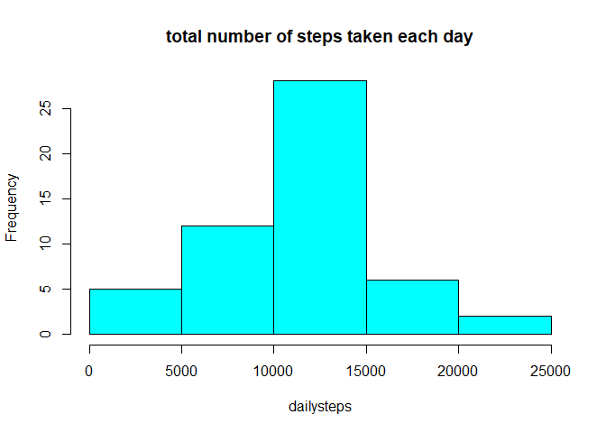
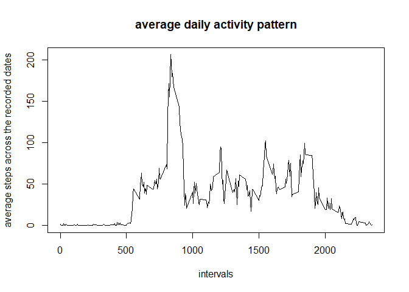
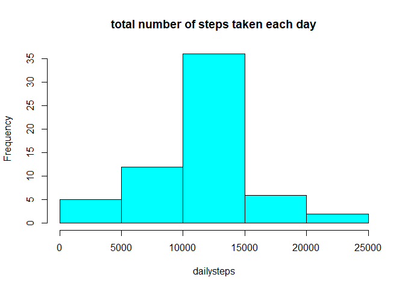
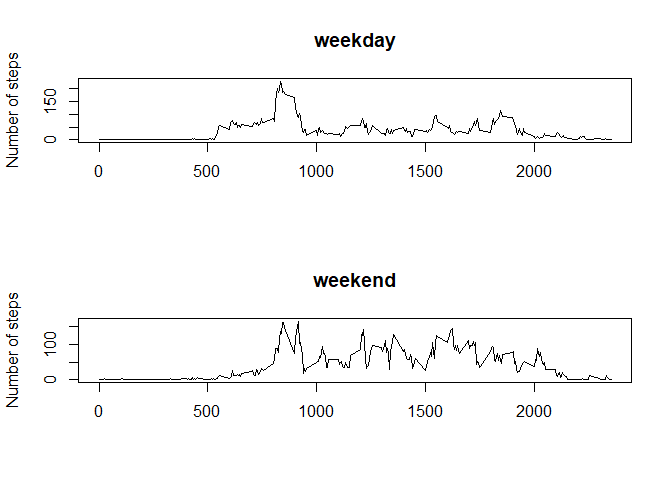

## Loading and preprocessing the data

```r
options(stringsAsFactors = FALSE)
## Load the data (i.e. `read.csv()`)
unzip("activity.zip")
dataset <- read.csv("activity.csv")
## Process/transform the data (if necessary) into a format suitable for your analysis.
dataset$date <- as.Date(dataset$date, "%Y-%m-%d")
```


## What is mean total number of steps taken per day?

```r
## Ignore the missing values in the dataset.
nonadata <- na.omit(dataset)
## Calculate the total number of steps taken each day.
dates <- unique(nonadata$date)
templist <- list()
for (i in 1:length(dates)) {
    templist[[i]] <- nonadata[nonadata$date == dates[i],1]
}
dailysteps <- sapply(templist, sum)
## Make a histogram of the total number of steps taken each day.
hist(dailysteps, col = "cyan", main = "total number of steps taken each day")
```

<!-- -->

```r
## Calculate and report the mean and median total number of steps taken per day.
print(paste("The mean total number of steps taken each day was", mean(dailysteps)))
```

```
## [1] "The mean total number of steps taken each day was 10766.1886792453"
```

```r
print(paste("The median total number of steps taken each day was", median(dailysteps)))
```

```
## [1] "The median total number of steps taken each day was 10765"
```


## What is the average daily activity pattern?

```r
## Calculate average number of steps taken, averaged across all days.
intervals <- unique(nonadata$interval)
templist <- list()
for (i in 1:length(intervals)) {
    templist[[i]] <- nonadata[nonadata$interval == intervals[i],1]
}
aveintsteps <- sapply(templist, mean)
## Make a time series plot of the 5-minute interval (x-axis) and the 
## average number of steps taken, averaged across all days (y-axis).
plot(intervals, aveintsteps, type = "l", main = "average daily activity pattern", 
     xlab = "intervals", ylab = "average steps across the recorded dates")
```

<!-- -->

```r
## Print the 5-minute interval with the maximum number of steps.
print(paste("The 5-minute interval that contains the maximum number of steps on average across all the days in the dataset is no.", 
            intervals[which(aveintsteps == max(aveintsteps))]))
```

```
## [1] "The 5-minute interval that contains the maximum number of steps on average across all the days in the dataset is no. 835"
```


## Imputing missing values

```r
## Calculate and report the total number of missing values in the dataset.
narows <- !complete.cases(dataset)
print(paste("The total number of rows with `NA`s were", sum(narows)))
```

```
## [1] "The total number of rows with `NA`s were 2304"
```

```r
## Create a new dataset that is equal to the original dataset but 
## with the missing data filled in by means for the 5-minute intervals.
nafilleddata <- dataset
for (i in which(narows)) {
    nafilleddata[i,1] <- aveintsteps[which(intervals == nafilleddata[i,3])]
}
## Make a histogram of the total number of steps taken each day.
## Calculate and report the mean and median total number of steps taken per day.
dates <- unique(nafilleddata$date)
templist <- list()
for (i in 1:length(dates)) {
    templist[[i]] <- nafilleddata[nafilleddata$date == dates[i],1]
}
dailysteps <- sapply(templist, sum)
hist(dailysteps, col = "cyan", main = "total number of steps taken each day")
```

<!-- -->

```r
print(paste("The mean total number of steps taken each day was", mean(dailysteps)))
```

```
## [1] "The mean total number of steps taken each day was 10766.1886792453"
```

```r
print(paste("The median total number of steps taken each day was", median(dailysteps)))
```

```
## [1] "The median total number of steps taken each day was 10766.1886792453"
```
With such a strategy to fill in NA values, the mean total numbers of steps taken each day remain the same, and the median total numbers of steps taken each day are shifted to the mean compared with the estimates from the first part.

## Are there differences in activity patterns between weekdays and weekends?

```r
## Create a factor variable "day" in the dataset indicating whether a given date 
## is a weekday or weekend day.
days <- vector(length = nrow(nafilleddata))
for (i in 1:length(days)) {
    days[i] <- ifelse(weekdays(nafilleddata[i,2]) %in% c("Saturday","Sunday"), 
                      "weekend", "weekday")
}
nafilleddata$day <- factor(days)
## Make a panel plot containing a time series plot of the 5-minute interval (x-axis) 
## and the average number of steps taken, averaged across all weekday days or 
## weekend days (y-axis).
intervals <- unique(nafilleddata$interval)
calcave <- function(tdata = nafilleddata, week) {
    templist <- list()
    tempdata <- nafilleddata[nafilleddata$day == week,]
    for (i in 1:length(intervals)) {
        templist[[i]] <- tempdata[tempdata$interval == intervals[i],1]
    }
    aveintsteps <- sapply(templist, mean)
}
aveweekday <- calcave(week = "weekday")
aveweekend <- calcave(week = "weekend")
par(mfrow = c(2,1))
plot(intervals, aveweekday, type = "l", main = "weekday", 
     xlab = "", ylab = "Number of steps")
plot(intervals, aveweekend, type = "l", main = "weekend", 
     xlab = "", ylab = "Number of steps")
```

<!-- -->
